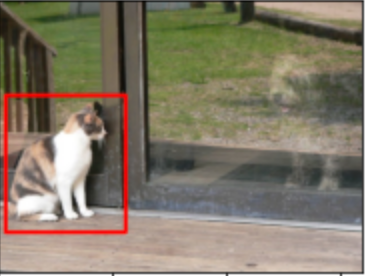

# *Reference*

- [Machine-Learn-Collection Data augmentation using Albumentations](https://github.com/aladdinpersson/Machine-Learning-Collection/tree/master/ML/Pytorch/Basics/albumentations_tutorial)
引用這作者的範例，以我個人的角度記錄及說明
-------------

Data Augmentation 利用現有的資料集來產生出更多延伸出來的資料，因此對於影像這個資料集而言就有分幾項比較有名的應用
	1. Segmentation 
	2. Detection
	3. Classification
而對於不同的應用就會需要做一些不同的手腳，因此這邊針對不同的應用來進行 Data Augmentation.

然後這次的範例練習單純只是做影像上的處理，因此不會用到 PyTorch 的部分

### 觀察用的 Function
先來做一些事前的處理，包含 `Google Driver` 跟 `plot images`  這些工具先準備好

- Plot images
```Python
import cv2
from matplotlib import pyplot as plt
import numpy as np
import albumentations as A
from PIL import Image

def plot_examples(images, bboxes=None):
    fig = plt.figure(figsize=(15, 15))
    columns = 4
    rows = 5

    for i in range(1, len(images)):
        if bboxes is not None:
            img = visualize_bbox(images[i - 1], bboxes[i - 1], class_name="Elon")
        else:
            img = images[i-1]
        fig.add_subplot(rows, columns, i)
        plt.imshow(img)
    plt.show()


# From https://albumentations.ai/docs/examples/example_bboxes/
def visualize_bbox(img, bbox, class_name, color=(255, 0, 0), thickness=5):
    """Visualizes a single bounding box on the image"""
    x_min, y_min, x_max, y_max = map(int, bbox)
    cv2.rectangle(img, (x_min, y_min), (x_max, y_max), color, thickness)
    return img
```


- Google Driver 存取權限
```Python
from google.colab import drive
drive.mount('/content/drive')
```

### Classification Dataset

影像的`Classification`就是使用比較單純的Dataset，針對整個檔案做`Label`，一個影像圖片就是輸出一個分類的結果，原始圖如下


然後 `Augmentation` 就是，針對整張的影像做轉向調整角度及亮度等等的手法讓機器學習怎麼判斷類別

```Python
classification_image = Image.open("/content/drive/MyDrive/Colab Notebooks/ithome/albumentations/cat_class.jpg")

classification_trans = A.Compose(
    [
        A.Resize(width=1920, height=1080),
        A.RandomCrop(width=1280, height=720),
        A.Rotate(limit=40, p=0.9, border_mode=cv2.BORDER_CONSTANT),
        A.HorizontalFlip(p=0.5),
        A.VerticalFlip(p=0.1),
        A.RGBShift(r_shift_limit=25, g_shift_limit=25, b_shift_limit=25, p=0.9),
        A.OneOf([
            A.Blur(blur_limit=3, p=0.5),
            A.ColorJitter(p=0.5),
        ], p=1.0),
    ]
)

images_list = [classification_image]
image = np.array(classification_image)
for i in range(15):
    augmentations = classification_trans(image=image)
    augmented_img = augmentations["image"]
    images_list.append(augmented_img)
plot_examples(images_list)
```

做出來的結果就如下方圖 (*左上角的為原本的圖*)


### Object Detection Dataset
YOLO 演算法就是一個很有名的應用，簡單來講就是在影像中偵測各種物件，就像是如左上角那張圖，紅匡會匡著一個物件，原始圖如下：


```Python
cv2_image = cv2.imread("/content/drive/MyDrive/Colab Notebooks/ithome/albumentations/cat.jpg")
cv2_image = cv2.cvtColor(cv2_image, cv2.COLOR_BGR2RGB)
bboxes = [[13, 170, 224, 410]]

# Pascal_voc (x_min, y_min, x_max, y_max), YOLO, COCO

transform = A.Compose(
    [
        A.Resize(width=1920, height=1080),
        A.RandomCrop(width=1280, height=720),
        A.Rotate(limit=40, p=0.9, border_mode=cv2.BORDER_CONSTANT),
        A.HorizontalFlip(p=0.5),
        A.VerticalFlip(p=0.1),
        A.RGBShift(r_shift_limit=25, g_shift_limit=25, b_shift_limit=25, p=0.9),
        A.OneOf([
            A.Blur(blur_limit=3, p=0.5),
            A.ColorJitter(p=0.5),
        ], p=1.0),
    ], bbox_params=A.BboxParams(format="pascal_voc", min_area=2048,
                                min_visibility=0.3, label_fields=[])
)

images_list = [cv2_image]
saved_bboxes = [bboxes[0]]
for i in range(15):
    augmentations = transform(image=cv2_image, bboxes=bboxes)
    augmented_img = augmentations["image"]

    if len(augmentations["bboxes"]) == 0:
        continue

    images_list.append(augmented_img)
    saved_bboxes.append(augmentations["bboxes"][0])

plot_examples(images_list, saved_bboxes)
```


而在Data Augmentation 的時候物體的位置可能移動或轉向，所以紅匡也透過計算跟著移動


### Segmentation Dataset

Segmentation  也是一個很類似物件偵測的方法，但是跟YOLO比較不一樣的地方就是 Segmantation 是pixel 的方法，而YOLO 是利用Box 的方法去匡列物件。
另外Pixel的方式就是一張原圖之外，還要另外加個Mask的東西，這個方式怎麼訓練的，可能就要去查看看演算法了，這邊就不提了
所以這邊就會需要幾張圖片，這張是原始的圖片


然後這張是加了mask的圖片，所以綠色的就是他的頭，紅色的就是他的衣服


另一個mask，就是一個深藍色裡面的紅色就是眼睛，黃色的就是嘴巴


這也是透過人工標記的方式去把物件標記起來的。然後我們這邊的 Image load 的部分就是直接使用 Image.open 起來

```Python

elon_image = Image.open("/content/drive/MyDrive/Colab Notebooks/ithome/albumentations/elon.jpeg")
elon_mask = Image.open("/content/drive/MyDrive/Colab Notebooks/ithome/albumentations/mask.jpeg")
elon_mask2 = Image.open("/content/drive/MyDrive/Colab Notebooks/ithome/albumentations/second_mask.jpeg")

transform = A.Compose(
    [
        A.Resize(width=1920, height=1080),
        A.RandomCrop(width=1280, height=720),
        A.Rotate(limit=40, p=0.9, border_mode=cv2.BORDER_CONSTANT),
        A.HorizontalFlip(p=0.5),
        A.VerticalFlip(p=0.1),
        A.RGBShift(r_shift_limit=25, g_shift_limit=25, b_shift_limit=25, p=0.9),
        A.OneOf([
            A.Blur(blur_limit=3, p=0.5),
            A.ColorJitter(p=0.5),
        ], p=1.0),
    ]
)

images_list = [elon_image]
image = np.array(elon_image)
mask = np.array(elon_mask) # np.asarray(mask), np.array(mask)
mask2 = np.array(elon_mask2)
for i in range(4):
	# 這邊要把mask加上去一起做 transform
    augmentations = transform(image=image, masks=[mask, mask2])
    augmented_img = augmentations["image"]
    augmented_masks = augmentations["masks"]
    images_list.append(augmented_img)
    images_list.append(augmented_masks[0])
    images_list.append(augmented_masks[1])
plot_examples(images_list)
```

最後跑出來的結果左上的為原圖，並從左上往右邊看，而右邊第一個為調整角度且壓縮過的圖，然後第二個是第一個mask 也做一樣的事情，再右邊的一個是第二個mask 也做同樣的事情

	因此記得在做這些任務的訓練資料如果只對原圖做 Data augmentation 是不夠的，mask 的影像也要一起處理


### 後續
因為這章節所使用到的圖片及程式碼比較多，因此到時候再丟到 Github 讓大家去玩玩看這ithome的每天的內容

----------
# *Reference*


- [Machine-Learn-Collection Data augmentation using Albumentations](https://github.com/aladdinpersson/Machine-Learning-Collection/tree/master/ML/Pytorch/Basics/albumentations_tutorial)
