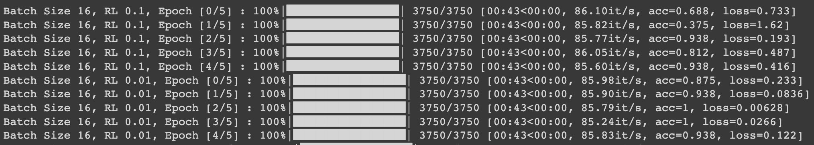

# *Reference*

- [Machine-Learn-Collection Simple Progress bar](https://github.com/aladdinpersson/Machine-Learning-Collection/blob/master/ML/Pytorch/Basics/pytorch_progress_bar.py)
引用這作者的範例，以我個人的角度記錄及說明
-------------
### 前言
這篇文章沒有直接來討論 Pytorch 上面的技術，單純來討論 Training Model 打發時間的視覺化，畢竟有時候在 Training Model 時電腦在跑也不知道完成了多少，因此利用這個小工具來呈現目前跑完的進度條


### 首先第一段就是 import 

**Dash 來呼叫** `torch_import`

### 宣告 CNN
就跟前面的CNN一樣，所以就是直接貼過來即可

```Python

class CNN(nn.Module):
    def __init__(self, in_channels=1, num_classes=10):
        super(CNN, self).__init__()
        self.conv1 = nn.Conv2d(
            in_channels=in_channels, out_channels=8, kernel_size=3, stride=1, padding=1
        )
        self.pool = nn.MaxPool2d(kernel_size=(2, 2), stride=(2, 2))
        self.conv2 = nn.Conv2d(
            in_channels=8, out_channels=16, kernel_size=3, stride=1, padding=1
        )
        self.fc1 = nn.Linear(16 * 7 * 7, num_classes)

    def forward(self, x):
        x = F.relu(self.conv1(x))
        x = self.pool(x)
        x = F.relu(self.conv2(x))
        x = self.pool(x)
        x = x.reshape(x.shape[0], -1)
        x = self.fc1(x)
        return x

```

### 載入資料集
這邊也是使用 `MNIST`，不過因為後面為了要跑 `Hyperparameter` ，所以 `Dataloader` 會丟到 
 `Hyperparameter` 裡面執行(**因為Dataloader 會吃到 Batch_size**)，然後記得 加入 device
 
**Dash 來呼叫** `torch_device`

```Python

in_channels = 1
num_classes = 10
num_epochs = 5

train_dataset = datasets.MNIST(
    root="dataset/", train=True, transform=transforms.ToTensor(), download=True
)
# Dataloader 後面再丟

# 下面 Hyperparameter
batch_sizes = [16, 64, 128]
learning_rates = [0.1, 0.01, 0.001]
```

### 訓練Model !! (Hyperparameter)
上面有說明 `Hyperparameter` ，因此 `batch_size` 和 `learning_rate` 移到最上面的迴圈

這邊的用法主要是配合 train_loader ，簡單來講就是資料切成很多 batch ，然後目前跑了多少了 batch
然後最下面的文字調整 `progress bar` 所呈現的資訊
```Python

for batch_size in batch_sizes:
    for learning_rate in learning_rates:
        step = 0
        model = CNN(in_channels=in_channels, num_classes=num_classes)
        model.to(device)
        model.train()
        criterion = nn.CrossEntropyLoss()
        # DataLoader放在這裡
        train_loader = DataLoader(
            dataset=train_dataset, batch_size=batch_size, shuffle=True
        )
        optimizer = optim.Adam(model.parameters(), lr=learning_rate, weight_decay=0.0)

        for epoch in range(num_epochs):
            losses = []
            accuracies = []
            # tqdm 是 progress bar 的工具
            loop = tqdm(enumerate(train_loader), total=len(train_loader))
            for batch_idx, (data, targets) in loop:
                data = data.to(device=device)
                targets = targets.to(device=device)

                scores = model(data)
                loss = criterion(scores, targets)
                losses.append(loss.item())

                optimizer.zero_grad()
                loss.backward()
                optimizer.step()

                features = data.reshape(data.shape[0], -1)
                img_grid = torchvision.utils.make_grid(data)
                _, predictions = scores.max(1)
                num_correct = (predictions == targets).sum()
                running_train_acc = float(num_correct) / float(data.shape[0])


				# 另外比較重要的是這邊 set_description 是 bar 前面的資訊
                loop.set_description(f"Batch Size {batch_size}, RL {learning_rate}, Epoch [{epoch+1}/{num_epochs}] ")
                # set_description 是 bar 後面的資訊
                loop.set_postfix(loss = loss.item(), acc=running_train_acc)
```

### 最後呈現結果
大概如下圖可以看到我們在訓練Model階段所加的 `set_description` 跟 `set_postfix`  會改變所呈現的內容


### 結語
我這邊還有另一種 Progress bar 的工具，如果要長時間訓練model 的狀況建議加一下 Pregress bar，因為如果畫面沒有任何的output ，那是電腦卡住還是有在跑會讓人懷疑人生～～

----------
# *Reference*

- [Machine-Learn-Collection Simple Progress bar](https://github.com/aladdinpersson/Machine-Learning-Collection/blob/master/ML/Pytorch/Basics/pytorch_progress_bar.py)
