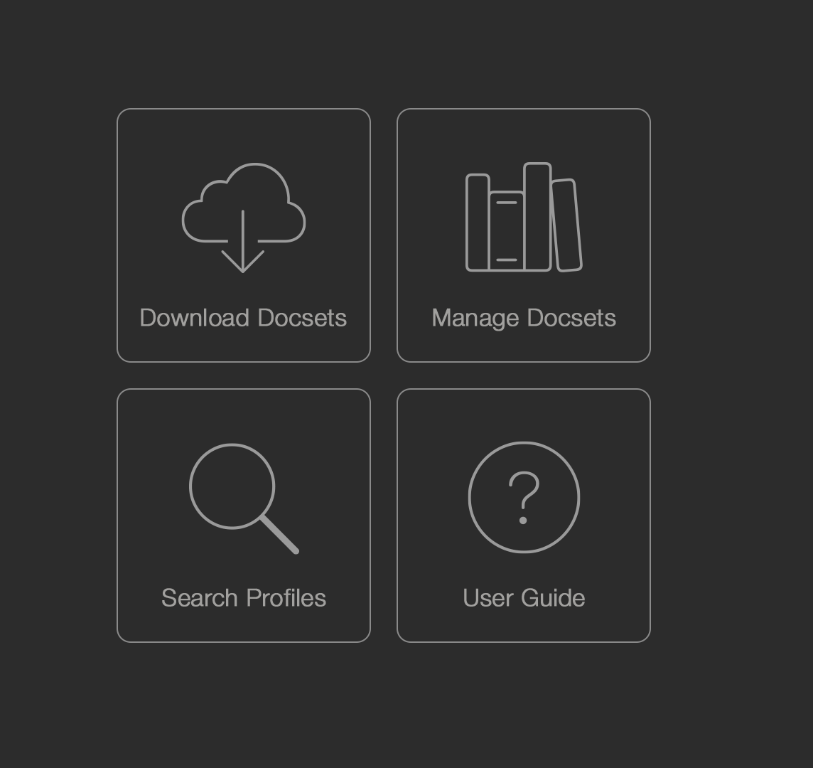
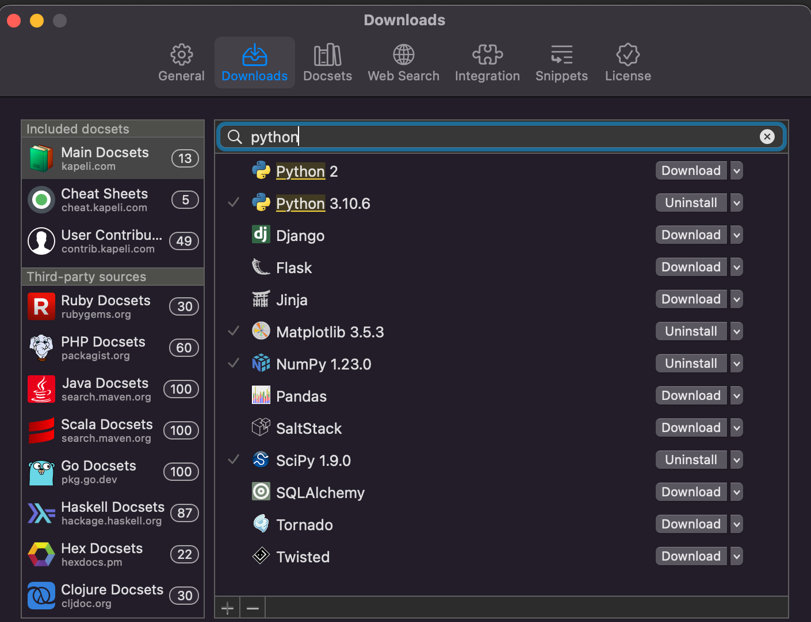
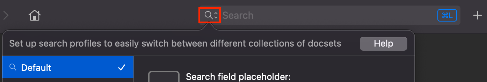
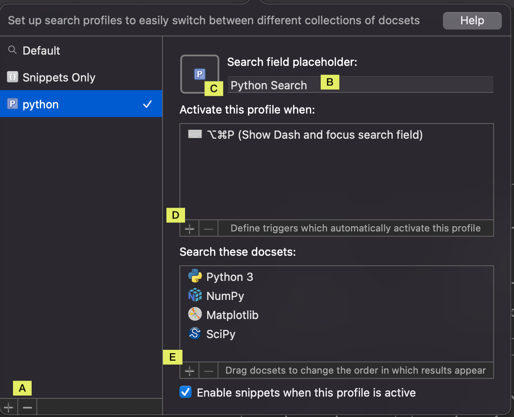
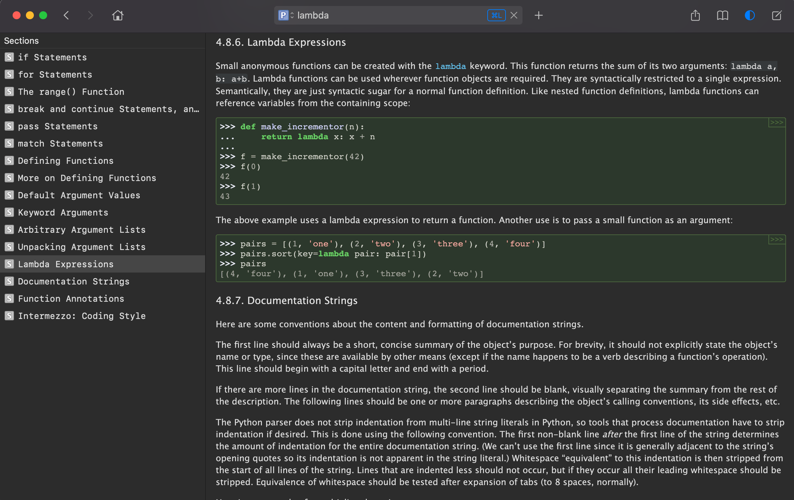
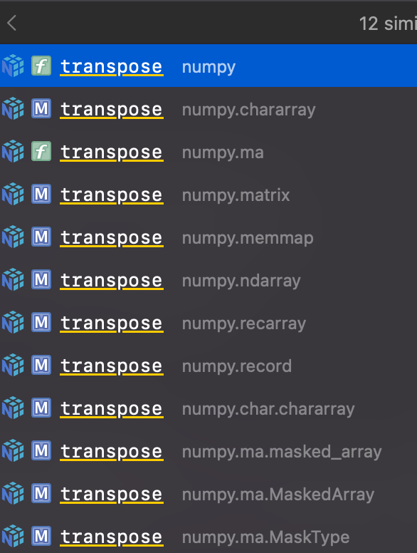

### Dash 
很多人以為他是在查詢 Documents(Docs) 及語法中 API 的軟體功能而已(Google都是這樣說)，但是這雖然是主要功能但是還是要花時間去看文件，Dash厲害就是可以幫忙不同語言的Docs下載到本機，然後可以直接搜索。

但如果只是要查Docs的話，看個人習慣有沒有需要搭配範例，==如果需要搭配範例的話就透過Google找出來的結果可能會比較適合== 。
另外就是習慣查文件的話Dash也可以很方便協助查詢

為什麼這邊需要特別抓出來介紹一次？除了湊天數的主要原因，另外Dash除了在找API 之外，另外主要是利用Snippet的功能，拯救了身為腦霧的資料科學家的小工具，當寫語法需要套入特定的演算法需要做特殊的轉換時，但是就忘記之前的Code放到何處，又要重新Google找資料，心裡就會覺得之前是怎麼寫出來的？

而如果時間久了 Model 跟轉換的方法就夠多了，如果沒有特別常使用的語法，當突然需要使用時常常 ==腦霧== 忘記API要怎麼用，就要Google 甚至可能忘記怎麼使用。

前面寫那麼多無聊的內容應該走了不少人了ＱＱ

### 小總結一下-What is Dash work?
1. 搜尋程式語言的API
2. ==建立自己的 Docs ==
3. ==建立自己片段文字keywork==

以上三點來探討，第一點離線搜尋的Docs就是Dash 主要的功能，其實隨便按一按就是不難發現這就是他的主要功能，然而我們這邊主要要介紹的是後面兩項功能，也就是幫助寫程式的黑魔法。

### 安裝
==這邊略過==

### 搜尋程式語言的 API
這邊就先用Python 為範例說明，因為資料科學主要的語言，首先在Dash home 介面像這樣

1. 點選`Download Docsets`，搜尋 `Python` ，然後就下載自己用到的Docset

2. 下載Docsets 完後，設定 Search Profile，在上方點選`符號`，然後進入設定畫面

3. Search Profile設定畫面，依序設定如下
    A. 先新增 Search Profile
    B. 輸入Profile名稱
    C. 選擇一個自己容易識別的icon ( 因為有時候可能需要不同的Docsets)
    D. 建立自己呼叫這個Docsets的快捷鍵(我上面設定的是 `Option` + `Command` + `P`) 
	E. 新增Search Docsets (`Python3`, `NumPy`, `Matplotlib`, `SciPy` 這四項)

接下來講使用 Dash 的情境：

首先 Dash 開著放著，然後在自己的編輯環境中遇到了寫 `Python` 上的問題，就按快捷鍵 `Option` + `Command` + `P` 之後直接輸入想查詢的 `keyword` 就可以查詢

情境一： 例如忘記Lambda Expressions 要怎麼使用？
就是使用上面快捷鍵跟 `Keyword` 的部分換成 *lambda*，然後就會出現內容及範例說明

情境二： NumPy 要怎麼 `transpose`?
就是使用上面快捷鍵跟 `Keyword` 的部分換成 *transpose*，然後就會出現各種型態的transpose，然後就依據自己的狀況去查詢使用

==後面兩個功能明天再一起講==

### Reference 
[Dash](https://kapeli.com/dash)
