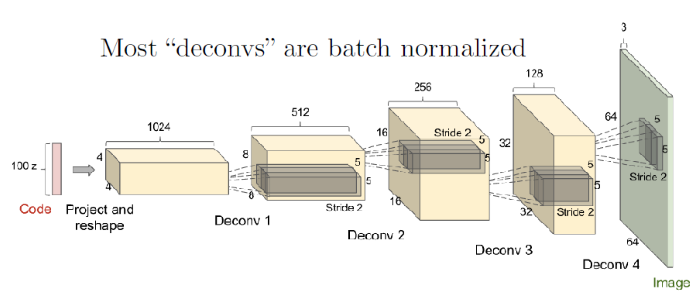
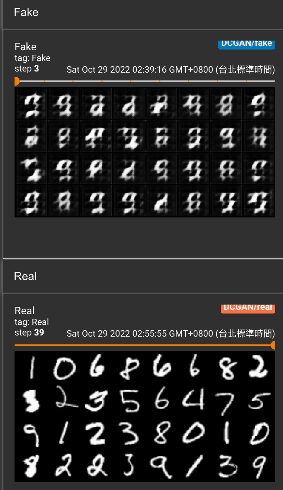
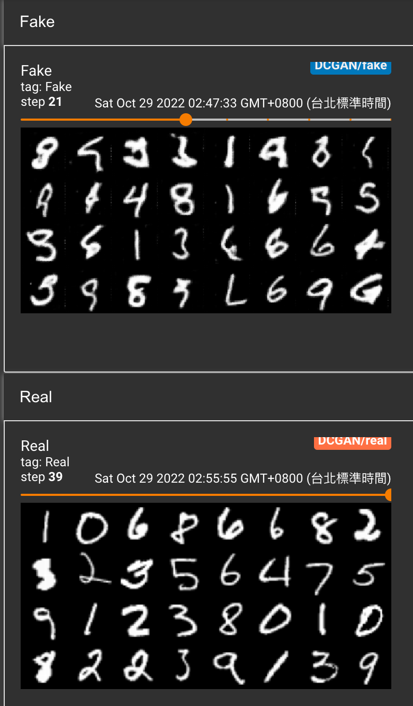

# *Reference*

- [Machine-Learn-Collection DCGAN](https://github.com/aladdinpersson/Machine-Learning-Collection/tree/master/ML/Pytorch/GANs/2.%20DCGAN)
引用這作者的範例，以我個人的角度記錄及說明
-------------

### 前言
這次來講解釋DCGAN ，而DCGAN 跟上一章節架構上沒有太大的差異，而改變的地方就是這裡加入CNN的概念來對圖片處理，可以看下面這張圖


從一開始的 Z_dim 就慢慢透過反卷積的機制，還原成一張 RGB 大小為64x64 的圖片，然而這是Generator 的部分，Discriminator 的部分則是把一個圖片做卷積來判斷是不是一個真實的圖片。


### import package and Tensorboard
這邊先載入package
```Python
import torch
import torch.nn as nn
import torch.optim as optim
import torchvision
import torchvision.datasets as datasets
from torch.utils.data import DataLoader
import torchvision.transforms as transforms
from torch.utils.tensorboard import SummaryWriter  # to print to tensorboard
```
當然還有colab 上面的 tensorboard
```Python
# 外部載入 Tensorboard
%load_ext tensorboard
# 打開 Tensorboard 的版面，然後需要執行下面才會有
%tensorboard --logdir=runs
```

### Generator 
從上面的圖片來接著講的話，先來講 Generator 的部分可能會比較清楚，一開始進來的noise 是z_dim =100, features_g 的話則是依據 1024 -> 512 -> 256 這種規律，因此這邊設定為64，第二層之後的層數都需要設定 strite = 2，所以每層的 in_channels 剛好都會是 out_channels 的兩倍，寬度跟高度就會變成2倍，層數越後面代表越來越短，而最後的output 的寬度跟高度為64x64的大小，這就是 Deconv 的功用。
最後的Output Tanh就是把數字轉換成-1 至 1 之間，channels_img = 1 是因為MNIST是黑白的圖片。
```Python
class Generator(nn.Module):
    def __init__(self, channels_noise, channels_img, features_g):
        super(Generator, self).__init__()
        self.net = nn.Sequential(
            # Input: N x channels_noise x 1 x 1
            self._block(channels_noise, features_g * 16, 4, 1, 0),  # img: 4x4
            self._block(features_g * 16, features_g * 8, 4, 2, 1),  # img: 8x8
            self._block(features_g * 8, features_g * 4, 4, 2, 1),  # img: 16x16
            self._block(features_g * 4, features_g * 2, 4, 2, 1),  # img: 32x32
            nn.ConvTranspose2d(
                features_g * 2, channels_img, kernel_size=4, stride=2, padding=1
            ),
            # Output: N x channels_img x 64 x 64
            nn.Tanh(),
        )

    def _block(self, in_channels, out_channels, kernel_size, stride, padding):
        return nn.Sequential(
            nn.ConvTranspose2d(
                in_channels,
                out_channels,
                kernel_size,
                stride,
                padding,
                bias=False,
            ),
            #nn.BatchNorm2d(out_channels),
            nn.ReLU(),
        )

    def forward(self, x):
        return self.net(x)

```


### Discriminator

Discriminator 主要的就是收到一張圖片，然後直接透過 convolution ，一直不斷地把張數猶大張慢慢地轉成小張，最後就是一個output 為 Yes or No 的結果，所以放 Sigmoid function。

`然而論文的話是使用64x64，但是MNIST 為28x28 所以 load dataset 的時候就有做resize為 64x64`

```Python

class Discriminator(nn.Module):
    def __init__(self, channels_img, features_d):
        super(Discriminator, self).__init__()
        self.disc = nn.Sequential(
            # input: N x channels_img(如果RGB圖片的話這裡為3) x 64 x 64
            # MNIST的資料集因為為黑白圖片所以channels_img設定為1，(如果RGB圖片的話這裡為3)
            nn.Conv2d(
                channels_img, features_d, kernel_size=4, stride=2, padding=1
            ),
            nn.LeakyReLU(0.2),
            # _block(in_channels, out_channels, kernel_size, stride, padding)
            self._block(features_d, features_d * 2, 4, 2, 1),
            self._block(features_d * 2, features_d * 4, 4, 2, 1),
            self._block(features_d * 4, features_d * 8, 4, 2, 1),
            # After all _block img output is 4x4 (Conv2d below makes into 1x1)
            nn.Conv2d(features_d * 8, 1, kernel_size=4, stride=2, padding=0),
            nn.Sigmoid(),
        )
	# block 做的事情就是 conv2d 跟 LeakyReLU 而已
    def _block(self, in_channels, out_channels, kernel_size, stride, padding):
        return nn.Sequential(
            nn.Conv2d(
                in_channels,
                out_channels,
                kernel_size,
                stride,
                padding,
                bias=False,
            ),
            #nn.BatchNorm2d(out_channels),
            nn.LeakyReLU(0.2),
        )

    def forward(self, x):
        return self.disc(x)
```


### Initial Weight & Test Generator and Discriminator
然後一開始的初始化權重就是一個常態的分佈，而test的部分是作者在檢測 Generator 跟 Discriminator 是不是可以正常的運作。如果可以正常的運作接著就可以開始做了
```Python
def initialize_weights(model):
    # Initializes weights according to the DCGAN paper
    for m in model.modules():
        if isinstance(m, (nn.Conv2d, nn.ConvTranspose2d, nn.BatchNorm2d)):
            nn.init.normal_(m.weight.data, 0.0, 0.02)

def test():
    N, in_channels, H, W = 8, 3, 64, 64
    noise_dim = 100
    x = torch.randn((N, in_channels, H, W))
    disc = Discriminator(in_channels, 8)
    assert disc(x).shape == (N, 1, 1, 1), "Discriminator test failed"
    gen = Generator(noise_dim, in_channels, 8)
    z = torch.randn((N, noise_dim, 1, 1))
    assert gen(z).shape == (N, in_channels, H, W), "Generator test failed"

test()

```

### Hyperparameter 
這邊有一些參數方便理解所以做一個設定，這裡可以調整然後來看哪些參數會讓訓練可以更快
```Python
device = torch.device("cuda" if torch.cuda.is_available() else "cpu")
LEARNING_RATE = 2e-4  # could also use two lrs, one for gen and one for disc
BATCH_SIZE = 128
IMAGE_SIZE = 64 # 圖片的大小，要做 resize 使用的
CHANNELS_IMG = 1
NOISE_DIM = 100
NUM_EPOCHS = 30
FEATURES_DISC = 64 # 這是那個特徵長度的 64 -> 128 -> 256 -> 512 ->  1024
FEATURES_GEN = 64 # 跟DISC 一樣是特徵長度，但是順序是相反的
```

### Data Preprocess
資料集的部分使用 MNIST 然後圖片大小為28x28 ，所以這邊在執行 Tranform的時候會resize 為 64x64，然後轉換成 Tensor 在做 Normalize 這部分很重要。
至於為什麼會出現 `range(CHANNELS_IMG)` 的部分就是作者他後面會訓練一個RGB的所以CHANNELS_IMG =3 ，然後減少改程式碼，所以就這樣設定
```Python

transforms = transforms.Compose(
    [
        transforms.Resize(IMAGE_SIZE),
        transforms.ToTensor(),
        transforms.Normalize(
            [0.5 for _ in range(CHANNELS_IMG)], [0.5 for _ in range(CHANNELS_IMG)]
        ),
    ]
)

# If you train on MNIST, remember to set channels_img to 1
dataset = datasets.MNIST(root="dataset/", train=True, transform=transforms,
                       download=True)

# comment mnist above and uncomment below if train on CelebA
#dataset = datasets.ImageFolder(root="celeb_dataset", transform=transforms)
dataloader = DataLoader(dataset, batch_size=BATCH_SIZE, shuffle=True)
```
這邊就是把 mnist 換成 CelebA 的資料集去做訓練，如過有興趣的可以試著去下載，但是我colab的使用資源用爆了，所以留著之後有空來玩玩看

### 宣告GAN ＆ Optimal function
```Python
gen = Generator(NOISE_DIM, CHANNELS_IMG, FEATURES_GEN).to(device)
disc = Discriminator(CHANNELS_IMG, FEATURES_DISC).to(device)
initialize_weights(gen)
initialize_weights(disc)

opt_gen = optim.Adam(gen.parameters(), lr=LEARNING_RATE, betas=(0.5, 0.999))
opt_disc = optim.Adam(disc.parameters(), lr=LEARNING_RATE, betas=(0.5, 0.999))
criterion = nn.BCELoss()

fixed_noise = torch.randn(32, NOISE_DIM, 1, 1).to(device)
writer_real = SummaryWriter(f"runs/DCGAN/real")
writer_fake = SummaryWriter(f"runs/DCGAN/fake")
step = 0


```

### Train
loss function 的部分前面一天就有說過這部分是怎麼計算的，這邊就不用特別在說明，請參考前面一篇。
這邊每跑完100個 batch_idx 就把step +1 所以這邊要注意一下 step ，但訓練 GAN的時候都是一整個 epoch 才會做 backward 更新，所以這部分的在看 tensorboard 的時候要稍微著一下

```Python

gen.train()
disc.train()

for epoch in range(NUM_EPOCHS):
    # Target labels not needed! unsupervised
    for batch_idx, (real, _) in enumerate(dataloader):
        real = real.to(device)
        noise = torch.randn(BATCH_SIZE, NOISE_DIM, 1, 1).to(device)
        fake = gen(noise)

        ### Train Discriminator: max log(D(x)) + log(1 - D(G(z)))
        disc_real = disc(real).reshape(-1)
        loss_disc_real = criterion(disc_real, torch.ones_like(disc_real))
        disc_fake = disc(fake.detach()).reshape(-1)
        loss_disc_fake = criterion(disc_fake, torch.zeros_like(disc_fake))
        loss_disc = (loss_disc_real + loss_disc_fake) / 2
        disc.zero_grad()
        loss_disc.backward()
        opt_disc.step()

        ### Train Generator: min log(1 - D(G(z))) <-> max log(D(G(z))
        output = disc(fake).reshape(-1)
        loss_gen = criterion(output, torch.ones_like(output))
        gen.zero_grad()
        loss_gen.backward()
        opt_gen.step()

        # Print losses occasionally and print to tensorboard
        if batch_idx % 100 == 0:
            print(
                f"Epoch [{epoch}/{NUM_EPOCHS}] Batch {batch_idx}/{len(dataloader)} \
                  Loss D: {loss_disc:.4f}, loss G: {loss_gen:.4f}"
            )

            with torch.no_grad():
                fake = gen(fixed_noise)
                # take out (up to) 32 examples
                img_grid_real = torchvision.utils.make_grid(
                    real[:32], normalize=True
                )
                img_grid_fake = torchvision.utils.make_grid(
                    fake[:32], normalize=True
                )

                writer_real.add_image("Real", img_grid_real, global_step=step)
                writer_fake.add_image("Fake", img_grid_fake, global_step=step)

            step += 1
```

### 結論
其實只需要train 一下就有基本的圖形就出來了，但是要要求每張圖片都很精準的話，其實真的有難度，而DCGAN 的訓練速度確實比單存使用 Fully connected 的來講效果好很多，所以這章節除了說明GAN的基本架構之外，然後還有實作 DCGAN 利用CNN 中convolution 來做 Generator and Discriminator 的部分，不過最讓人需要花時間的地方還是在 loss function 跟每一層的input 與 output 都需要花時間去理解。

一開始只有跑 3 steps的成果其實什麼都看不出來


訓練steps = 39 的結果其實有一點雛形了，成效算是不錯了。



但當然如果要求要很完美的話，就是要用時間去讓他慢慢訓練囉


----------
# *Reference*
- [Machine-Learn-Collection DCGAN](https://github.com/aladdinpersson/Machine-Learning-Collection/tree/master/ML/Pytorch/GANs/2.%20DCGAN)
- [Unsupervised Representation Learning with Deep Convolutional Generative Adversarial Networks](https://arxiv.org/abs/1511.06434)
